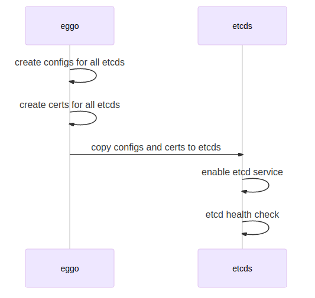

# etcd集群部署流程

### etcd集群

etcd集群高可用分布式建值数据库，在k8s集群中用于存储k8s的配置信息。etcd是独立与k8s的独立集群，可以随k8s集群独立部署，也可以独立部署，独立部署后只需要告诉k8s集群该etcd集群的地址和证书等信息即可，下图是部署etcd集群的流程：

1. 在eggo所在机器上生成etcd服务启动时的配置，包括etcd的环境变量文件etcd.conf以及etcd启动服务时的文件etcd.service，其中etcd.conf每个etcd节点一个，里面的环境变量的值也是根据etcd节点的配置不同而配置不同的参数。

2. 在eggo所在机器上生成etcd自己的ca证书并为每个etcd节点生成etcd证书，包括如下证书：

   "ca.crt", "healthcheck-client.crt", "peer.crt", "server.crt",
    "ca.key", "healthcheck-client.key", "peer.key", "server.key",

   除ca外，其他的证书都是每个etcd节点都需要生成一份不同的证书，存放在eggo所在机器时证书名称根据etcd的hostname添加前缀来区分。
   
3. 将生成好的etcd环境变量文件，service文件，以及证书文件，全部拷贝到etcd对应的节点上。

4. 使能etcd的service服务。

5. 在每个节点上使用etcdctl执行health check命令检查集群健康状态。